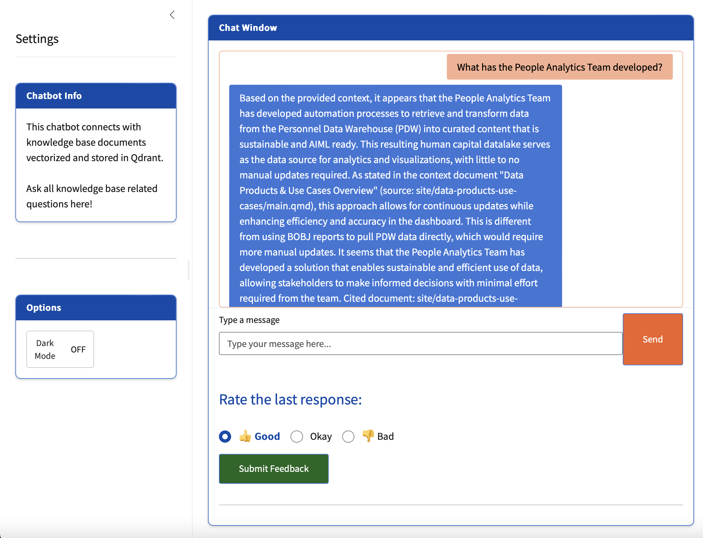

# Quarto Wiki Chatbot

## Setup

1. **Configure environment variables**
   Copy the example env file inside `chatbot_local/` and fill it in:
   ```bash
   cp chatbot_local/.env.example chatbot_local/.env
   ```
   Required values:
   ```properties
   QDRANT_URL
   QDRANT_API_KEY
   EMBEDDING_MODEL
   MODEL_ID
   ```
   Plus **one** of the following model-provider configs:
   ```properties
   # Option A — OpenAI-compatible
   OPENAI_API_KEY=
   OPENAI_BASE_URL=

   # Option B — Ollama
   OLLAMA_URL=
   ```
   Optional (leave blank if unused):
   ```properties
   PAT="ghp_yourToken"
   GITHUB_API="https://api.github.com"
   ORG="username_or_enterprise"
   REPO="your_repo_name"
   ```

2. **Install dependencies and validate config**
   ```bash
   make setup
   ```
   This restores the R environment (`renv::restore()`), installs Python dependencies via Poetry (shared `pyproject.toml` in `chatbot_local/`), and checks that `chatbot_local/.env` has all required values before continuing.

## Build the Qdrant Collection

```bash
make ingest
```

This starts Qdrant (via Docker Compose) and waits for it to report healthy, then runs `chatbot_local/scripts/create_qdrant_collections.py` to embed the `.qmd` files in `site/` into the vector database.

## Run the Chatbot App

```bash
make run
```

This ensures Qdrant is running, then launches the Shiny app. Open the chatbot at **http://127.0.0.1:5075**.



## Other Commands

| Command | What it does |
|---|---|
| `make setup` | One-time: restore R packages, install Python deps, validate `.env` |
| `make qdrant-up` | Start Qdrant only (used automatically by `ingest` and `run`) |
| `make qdrant-down` | Stop the Qdrant container |
| `make ingest` | Build/rebuild the Qdrant collection from `site/*.qmd` |
| `make run` | Launch the Shiny chatbot app |
| `make clean` | Stop Qdrant (R/Python environments are left untouched) |

## Project Structure

```
quarto-wiki-chatbot/
├── Makefile
├── docker-compose.yml
├── chatbot_local/
│   ├── .env               # your local config (not committed)
│   ├── .env.example
│   ├── pyproject.toml     # shared by chatbot_local/ and scripts/
│   └── scripts/
│       └── create_qdrant_collections.py
└── site/                  # .qmd source files
```

## Requirements

- R with `renv`
- Python with [Poetry](https://python-poetry.org/)
- [Docker](https://docs.docker.com/get-docker/) (for Qdrant)
- `make` (preinstalled on macOS/Linux; use WSL or Git Bash on Windows)


