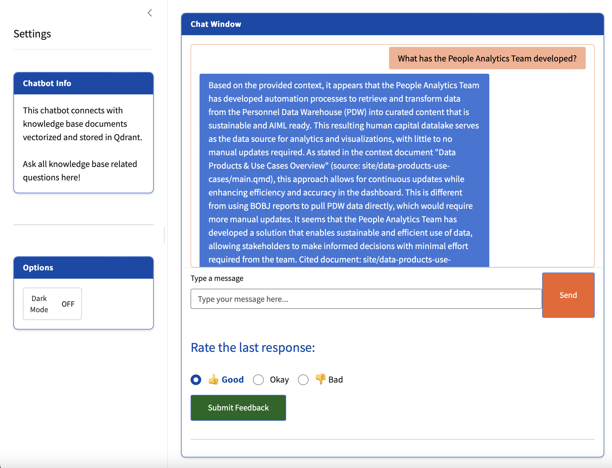

# People Analytics Knowledge Base Chatbot

## Setup

### Environment:
- cd `quarto-wiki-chatbot`
- In R terminal `source("renv/activate.R")` and follow the steps to create a lockfile.
- In terminal, cd `chatbot_local` and `poetry install`
- Create your own `.env` file (see `.env.example`) and configure local models and Qdrant database
    - [Qdrant setup](https://qdrant.tech/documentation/guides/security/) with Docker 
    - [OpenAI](https://platform.openai.com/docs/api-reference/introduction) compatible or [Ollama](https://docs.ollama.com/docker)
    - Note: Leave blank the env variables you don't use

### Create Qdrant Collection
Create a Qdrant collection based on the .qmd files in the `site` folder
- In terminal, cd `scripts` and `poetry run python create_qdrant_collections.py`

## Run the Chatbot App
- cd `chatbot_local` and `poetry run R -e "shiny::runApp('your_path/chatbot_local')"`
- Open the chatbot at http://127.0.0.1:5075 

